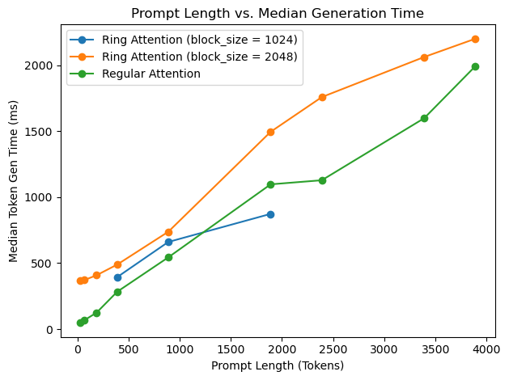

# Context Parallelism Using Ring Attention in LLaMA

## Description

This repository aims to implement the ring attention algorithm described in [Ring Attention with Blockwise Transformers for Near-Infinite Context](https://arxiv.org/abs/2310.01889). The aim of this algorithm is to extend the maximum sequence length feasible for traditional transformer algorithms by parallelising the attention and feed forward layers across context and split it across GPUs.

Since this project is mainly focused on inference optimzations and we had direct instruction from IBM's Antoni Viros i Martin to forgo its usage, we did not use it for this project.

## Code Outline

We fork off IBM's FMS open source pytorch library and modify the following key files:
```
fms/
├── distributed/
│   └── strategy.py
├── models/
│   ├── __init__.py
│   └── llama.py
│   └── llama_ring.py

```

The last file in that list was an addition by us which implements the core ring attention algorithm's computation which is effectively a re-implementation of the entire LLaMA_Block class where computations are tiled and KV caches are passed between GPUs. The other 3 files were modified so we could 

1) Initialize the distributed structures needed within ring attention
2) overwrite the forward pass of LLaMA_Block with our implementation iff. a distributed_strategy flag is passed in during inference


Within this repository we have another branch [fms-pr] which we aim to make an official pull-request with the original IBM repository 
## Run instructions

To properly run ring attention you will need access to multiple GPUs. The folowing commands assume this fact.

To run the benchmarks we ran 
```bash
# If you are on a cluster w/ slurm you can use the following 

# Assumes the following in your working dir:
# foundation-model-stack/
# ├── fms/
# │   ├── models/
# │   ├── modules/
# │   └── utils/
# └── tests/
#
# llama-hf/
# ├── config/
# ├── tokenizer/
# └── convert.py


sbatch --output=bench.out foundation-model-stack/scripts/llama_ring/benchmark_ring.slurm

# Alternatively call torchrun directly
torchrun --nproc_per_node=2 \
./scripts/llama_ring/benchmark_ring.py \
  --architecture llama \
  --variant 7b \
  --model_path $PATH_TO_MODEL \
  --tokenizer $PATH_TO_MODEL_TOKENIZER \
  --device_type cuda \
  --num_tokens_to_benchmark 30 \
  --batch_size 1 \
  --run_ring_first \
  --prompt_len 100
```

To just run inference

```bash
# If you are on a cluster w/ slurm you can use the following 

# Assumes the following in your working dir:
# foundation-model-stack/
# ├── fms/
# │   ├── models/
# │   ├── modules/
# │   └── utils/
# └── tests/
#
# llama-hf/
# ├── config/
# ├── tokenizer/
# └── convert.py


sbatch --output=inference.out foundation-model-stack/scripts/llama_ring/run_inference.slurm

# Alternatively call torchrun directly
torchrun --nproc_per_node=2 \
  ./scripts/inference.py \
  --architecture llama \
  --variant 7b \
  --model_path $PATH_TO_MODEL \
  --tokenizer $PATH_TO_MODEL_TOKENIZER \
  --model_source hf \
  --device_type cuda \
  --default_dtype fp16 \
  --distributed_strategy ring \
  --no_use_cache \
  --distributed
```

## Results

As a first pass at this algorithim we implemented a fixed blocksize of distributing between GPUS. We ran the following experiment with 2 GPUs which is the max we were able to test with and is well below the regime we believe this algorithm would excel in. Despite that fact, we see promising results shown int he 1024 block size benchmarks when we approach maximum supported sequence length of 2048. Similarly for a block size of 2048, the maximum supported sequence length is 4096 which is also the maximum expected sequence length of llama 7b, and we can see that as we approach that sequence length ring attention scale better than the default attention algorithm.



